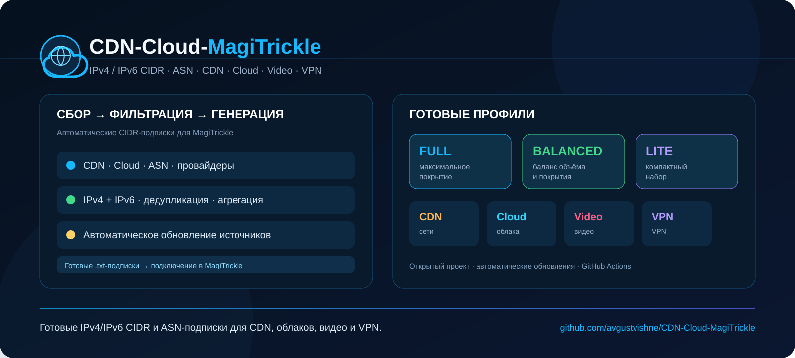

# CDN-Cloud-MagiTrickle

**Готовые IPv4/IPv6 CIDR-подписки для [MagiTrickle](https://github.com/MagiTrickle/MagiTrickle) — CDN, облака, видео, VPN, Telegram, Twitter/X**

[📊 Статус](STATUS.md) · [📝 Изменения](CHANGELOG.md) · [🤝 Вклад в проект](CONTRIBUTING.md)

---

## Что это

Репозиторий дважды в сутки собирает диапазоны адресов CDN, облачных провайдеров и отдельных сервисов, сверяет их между собой и публикует готовые `.txt`-подписки, которые можно напрямую подключить в MagiTrickle.

## Как использовать

1. Выбери набор в таблице ниже.
2. Открой ссылку IPv4 или IPv6 — она ведёт прямо на файл со списком адресов.
3. Добавь эту ссылку в MagiTrickle как источник подписки (URL, не файл).

## Готовые наборы

| Нужно | Набор | IPv4 | IPv6 |
|---|---|:---:|:---:|
| Максимальное покрытие | **FULL** | [скачать](https://raw.githubusercontent.com/avgustvishne/CDN-Cloud-MagiTrickle/main/data/presets/full-v4.txt) | [скачать](https://raw.githubusercontent.com/avgustvishne/CDN-Cloud-MagiTrickle/main/data/presets/full-v6.txt) |
| Широкое покрытие без гиперскейл-пулов | **BALANCED** | [скачать](https://raw.githubusercontent.com/avgustvishne/CDN-Cloud-MagiTrickle/main/data/presets/balanced-v4.txt) | [скачать](https://raw.githubusercontent.com/avgustvishne/CDN-Cloud-MagiTrickle/main/data/presets/balanced-v6.txt) |
| CDN + компактный периферийный набор | **PERFORMANCE** | [скачать](https://raw.githubusercontent.com/avgustvishne/CDN-Cloud-MagiTrickle/main/data/presets/performance-v4.txt) | [скачать](https://raw.githubusercontent.com/avgustvishne/CDN-Cloud-MagiTrickle/main/data/presets/performance-v6.txt) |
| Только базовый набор CDN | **MINIMAL** | [скачать](https://raw.githubusercontent.com/avgustvishne/CDN-Cloud-MagiTrickle/main/data/presets/minimal-v4.txt) | [скачать](https://raw.githubusercontent.com/avgustvishne/CDN-Cloud-MagiTrickle/main/data/presets/minimal-v6.txt) |
| Только CDN | **CDN** | [скачать](https://raw.githubusercontent.com/avgustvishne/CDN-Cloud-MagiTrickle/main/data/presets/cdn-v4.txt) | [скачать](https://raw.githubusercontent.com/avgustvishne/CDN-Cloud-MagiTrickle/main/data/presets/cdn-v6.txt) |
| Облако/VPS | **CLOUD** | [скачать](https://raw.githubusercontent.com/avgustvishne/CDN-Cloud-MagiTrickle/main/data/presets/cloud-v4.txt) | [скачать](https://raw.githubusercontent.com/avgustvishne/CDN-Cloud-MagiTrickle/main/data/presets/cloud-v6.txt) |
| Видео/CDN | **VIDEO** | [скачать](https://raw.githubusercontent.com/avgustvishne/CDN-Cloud-MagiTrickle/main/data/presets/video-v4.txt) | [скачать](https://raw.githubusercontent.com/avgustvishne/CDN-Cloud-MagiTrickle/main/data/presets/video-v6.txt) |
| VPN/VPS | **VPN** | [скачать](https://raw.githubusercontent.com/avgustvishne/CDN-Cloud-MagiTrickle/main/data/presets/vpn-v4.txt) | [скачать](https://raw.githubusercontent.com/avgustvishne/CDN-Cloud-MagiTrickle/main/data/presets/vpn-v6.txt) |
| Все собранные ASN | **ASN ALL** | [скачать](https://raw.githubusercontent.com/avgustvishne/CDN-Cloud-MagiTrickle/main/data/asn-all-v4.txt) | [скачать](https://raw.githubusercontent.com/avgustvishne/CDN-Cloud-MagiTrickle/main/data/asn-all-v6.txt) |
| То же, что FULL, но обновляется раз в неделю | **STABLE** | [скачать](https://raw.githubusercontent.com/avgustvishne/CDN-Cloud-MagiTrickle/main/data/presets/stable-v4.txt) | [скачать](https://raw.githubusercontent.com/avgustvishne/CDN-Cloud-MagiTrickle/main/data/presets/stable-v6.txt) |

**FULL** включает все провайдеры. **ALL-CLOUD** ([IPv4](https://raw.githubusercontent.com/avgustvishne/CDN-Cloud-MagiTrickle/main/data/all-cloud-v4.txt)/[IPv6](https://raw.githubusercontent.com/avgustvishne/CDN-Cloud-MagiTrickle/main/data/all-cloud-v6.txt)) — только AWS, Cloudflare, Microsoft, Oracle, Alibaba и DigitalOcean, отдельно от FULL.

## Отдельные провайдеры

Если нужен не готовый набор, а конкретный провайдер:

| Провайдер | IPv4 | IPv6 |
|---|:---:|:---:|
| AWS | [скачать](https://raw.githubusercontent.com/avgustvishne/CDN-Cloud-MagiTrickle/main/data/aws-v4.txt) | [скачать](https://raw.githubusercontent.com/avgustvishne/CDN-Cloud-MagiTrickle/main/data/aws-v6.txt) |
| Akamai | [скачать](https://raw.githubusercontent.com/avgustvishne/CDN-Cloud-MagiTrickle/main/data/akamai-v4.txt) | [скачать](https://raw.githubusercontent.com/avgustvishne/CDN-Cloud-MagiTrickle/main/data/akamai-v6.txt) |
| Alibaba Cloud | [скачать](https://raw.githubusercontent.com/avgustvishne/CDN-Cloud-MagiTrickle/main/data/alibaba-v4.txt) | [скачать](https://raw.githubusercontent.com/avgustvishne/CDN-Cloud-MagiTrickle/main/data/alibaba-v6.txt) |
| Backblaze | [скачать](https://raw.githubusercontent.com/avgustvishne/CDN-Cloud-MagiTrickle/main/data/backblaze-v4.txt) | [скачать](https://raw.githubusercontent.com/avgustvishne/CDN-Cloud-MagiTrickle/main/data/backblaze-v6.txt) |
| BuyVM | [скачать](https://raw.githubusercontent.com/avgustvishne/CDN-Cloud-MagiTrickle/main/data/buyvm-v4.txt) | [скачать](https://raw.githubusercontent.com/avgustvishne/CDN-Cloud-MagiTrickle/main/data/buyvm-v6.txt) |
| CDN77 | [скачать](https://raw.githubusercontent.com/avgustvishne/CDN-Cloud-MagiTrickle/main/data/cdn77-v4.txt) | [скачать](https://raw.githubusercontent.com/avgustvishne/CDN-Cloud-MagiTrickle/main/data/cdn77-v6.txt) |
| Cloudflare | [скачать](https://raw.githubusercontent.com/avgustvishne/CDN-Cloud-MagiTrickle/main/data/cloudflare-v4.txt) | [скачать](https://raw.githubusercontent.com/avgustvishne/CDN-Cloud-MagiTrickle/main/data/cloudflare-v6.txt) |
| Contabo | [скачать](https://raw.githubusercontent.com/avgustvishne/CDN-Cloud-MagiTrickle/main/data/contabo-v4.txt) | [скачать](https://raw.githubusercontent.com/avgustvishne/CDN-Cloud-MagiTrickle/main/data/contabo-v6.txt) |
| DigitalOcean | [скачать](https://raw.githubusercontent.com/avgustvishne/CDN-Cloud-MagiTrickle/main/data/digitalocean-v4.txt) | [скачать](https://raw.githubusercontent.com/avgustvishne/CDN-Cloud-MagiTrickle/main/data/digitalocean-v6.txt) |
| Fastly | [скачать](https://raw.githubusercontent.com/avgustvishne/CDN-Cloud-MagiTrickle/main/data/fastly-v4.txt) | [скачать](https://raw.githubusercontent.com/avgustvishne/CDN-Cloud-MagiTrickle/main/data/fastly-v6.txt) |
| Gcore | [скачать](https://raw.githubusercontent.com/avgustvishne/CDN-Cloud-MagiTrickle/main/data/gcore-v4.txt) | [скачать](https://raw.githubusercontent.com/avgustvishne/CDN-Cloud-MagiTrickle/main/data/gcore-v6.txt) |
| Hetzner | [скачать](https://raw.githubusercontent.com/avgustvishne/CDN-Cloud-MagiTrickle/main/data/hetzner-v4.txt) | [скачать](https://raw.githubusercontent.com/avgustvishne/CDN-Cloud-MagiTrickle/main/data/hetzner-v6.txt) |
| Melbicom | [скачать](https://raw.githubusercontent.com/avgustvishne/CDN-Cloud-MagiTrickle/main/data/melbicom-v4.txt) | [скачать](https://raw.githubusercontent.com/avgustvishne/CDN-Cloud-MagiTrickle/main/data/melbicom-v6.txt) |
| Microsoft Azure | [скачать](https://raw.githubusercontent.com/avgustvishne/CDN-Cloud-MagiTrickle/main/data/microsoft-v4.txt) | [скачать](https://raw.githubusercontent.com/avgustvishne/CDN-Cloud-MagiTrickle/main/data/microsoft-v6.txt) |
| Oracle Cloud | [скачать](https://raw.githubusercontent.com/avgustvishne/CDN-Cloud-MagiTrickle/main/data/oracle-v4.txt) | [скачать](https://raw.githubusercontent.com/avgustvishne/CDN-Cloud-MagiTrickle/main/data/oracle-v6.txt) |
| OVH | [скачать](https://raw.githubusercontent.com/avgustvishne/CDN-Cloud-MagiTrickle/main/data/ovh-v4.txt) | [скачать](https://raw.githubusercontent.com/avgustvishne/CDN-Cloud-MagiTrickle/main/data/ovh-v6.txt) |
| Scaleway | [скачать](https://raw.githubusercontent.com/avgustvishne/CDN-Cloud-MagiTrickle/main/data/scaleway-v4.txt) | [скачать](https://raw.githubusercontent.com/avgustvishne/CDN-Cloud-MagiTrickle/main/data/scaleway-v6.txt) |
| Telegram | [скачать](https://raw.githubusercontent.com/avgustvishne/CDN-Cloud-MagiTrickle/main/data/telegram-v4.txt) | [скачать](https://raw.githubusercontent.com/avgustvishne/CDN-Cloud-MagiTrickle/main/data/telegram-v6.txt) |
| Twitter/X | [скачать](https://raw.githubusercontent.com/avgustvishne/CDN-Cloud-MagiTrickle/main/data/twitter-v4.txt) | [скачать](https://raw.githubusercontent.com/avgustvishne/CDN-Cloud-MagiTrickle/main/data/twitter-v6.txt) |
| Vultr | [скачать](https://raw.githubusercontent.com/avgustvishne/CDN-Cloud-MagiTrickle/main/data/vultr-v4.txt) | [скачать](https://raw.githubusercontent.com/avgustvishne/CDN-Cloud-MagiTrickle/main/data/vultr-v6.txt) |

<!-- AUTO-STATS:START -->
## 📊 Актуальная статистика

| Набор | IPv4 | IPv6 |
|---|---:|---:|
| **FULL** | **17 571 CIDR** | **5 295 CIDR** |
| **BALANCED** | **9 258 CIDR** | **3 088 CIDR** |
| **PERFORMANCE** | **2 097 CIDR** | **690 CIDR** |
| **MINIMAL** | **1 854 CIDR** | **675 CIDR** |
| **STABLE** | **17 471 CIDR** | **5 264 CIDR** |
| **CDN** | **1 854 CIDR** | **675 CIDR** |
| **CLOUD** | **8 989 CIDR** | **2 296 CIDR** |
| **VIDEO** | **7 357 CIDR** | **2 072 CIDR** |
| **VPN** | **8 308 CIDR** | **2 684 CIDR** |
| **MESSAGING** | **19 CIDR** | **8 CIDR** |
| **ASN ALL** | **12 615 CIDR** | **6 001 CIDR** |
| **ALL-CLOUD** | **8 989 CIDR** | **2 309 CIDR** |

**Обновлено:** 23 сентября 2026, 09:46 UTC · [полная статистика](data/statistics.json)

> Статистика рассчитывается из опубликованных нормализованных CIDR-файлов после успешного прохождения проверок.
<!-- AUTO-STATS:END -->

---

Подписки обновляются автоматически дважды в сутки. Для разработчиков и контрибьюторов — устройство пайплайна и как добавить провайдера в [CONTRIBUTING.md](CONTRIBUTING.md), история изменений в [CHANGELOG.md](CHANGELOG.md).

Лицензия — [MIT](LICENSE).

Если проект оказался полезен — можно [поддержать его](https://tips.tips/000484125) ❤️
